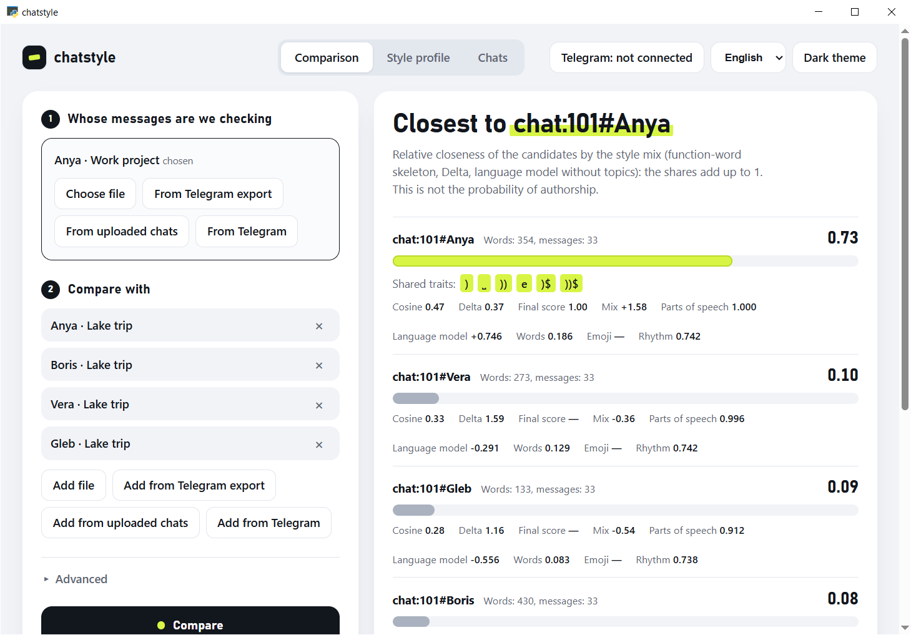
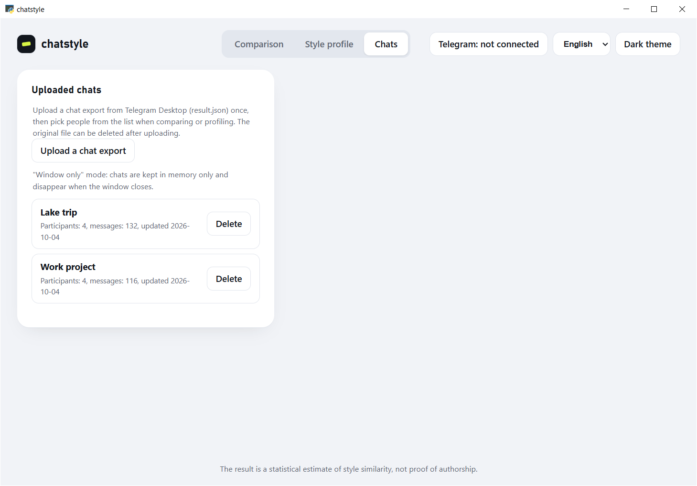

# chatstyle

[English](README.md) | [Русский](README.ru.md) | [Español](README.es.md) | [Français](README.fr.md) | **中文** | [العربية](README.ar.md)

一个命令行工具（带桌面窗口），用于核实俄语聊天消息的作者身份。它回答这样的问题：“未知发送者的消息，与候选人的消息是否出自同一个人之手？”，并展示答案所依据的特征。

> **结果只是对文风相似度的统计估计，不是作者身份的证明。** 它可能出错，取决于文本量，不应作为对人下结论的唯一依据。详见[局限性](#局限性)和[伦理与隐私](#伦理与隐私)。

> **状态：0.1 版，v1.0 发布之前。** 尚无真实数据上的质量评估结果，参见[质量评估](#质量评估)和[状态与已知缺口](#状态与已知缺口)。

命令行输出、报告和错误信息均为俄语（窗口本身已翻译成六种语言）。下面的示例按原样展示真实输出。

## 功能

- **基于文风的方法组合。** 默认按以下三项给候选人排序：功能词“骨架”、Burrows Delta，以及对罕见词做了遮蔽的文本上的语言模型（因此话题几乎不影响结果），各项 z 分数权重相等。`--lexical` 选项会加入词汇（见“如何解读结果”）。在真实聊天上的检验见“状态与已知缺口”。
- **三种比较方法**（全部在本地计算）：
  - 字符 n-gram（1-4）TF-IDF 的余弦相似度，作为基线，并说明哪些 n-gram 相吻合；
  - 基于文风特征的 **Burrows Delta**：标点习惯（括号“)”、“))”、省略号、“!!”、“??”、逗号与连词、符号周围的空格、破折号、引号），大小写与拼写（全大写、拉长的词、“тся/ться”的写法、西里尔字母与拉丁字母混用、双空格、非规范拼写），“ё”/“е”，拉丁字母，表情符号，词汇丰富度，词、句子和消息的长度，功能词和口头禅的频率（共约 40 个特征，它们同时构成文风画像）；
  - **General Impostors**：候选人的文本是否始终比外部作者的文本更接近未知文本。其得分（0..1）即**最终得分**。
- **三种数据来源：**文本文件、Telegram Desktop 的 JSON 导出、通过 Telethon 使用 Telegram。
- **报告**为 Markdown 和 HTML：表格、最吻合的特征、文风差异、方法说明。
- 单个作者的**文风画像**：`chatstyle features`。
- 任何一方少于 1000 词时给出警告。

## 截图

在 `docs/demo/` 的**虚构**数据上运行的真实应用窗口：同样四个虚构人物之间的两段聊天（湖边旅行和工作项目）。未知文本：工作聊天中的 Anya；候选人：旅行聊天中的四个人。窗口以英文显示（它还支持俄语、Español、Français、中文和 العربية）。






这些虚构聊天还有俄语、英语、西班牙语、法语、中文和阿拉伯语版本（由作者翻译，并非母语者所写）：`python docs/demo_eval.py` 会在每种语言上检验同一作者能否从一段聊天被认出到另一段（每种语言 8 个任务；这里均为 8 中 8）。角色的习惯被刻意设计得很鲜明，因此这项检验只说明该方法能处理这些文字，而不说明它在真人上的准确度。

## 快速开始

仓库里有几个很小的虚构文件 `tests/fixtures/*.txt`（每行一条消息）。[安装](#安装)之后：

```bash
chatstyle compare -u file:tests/fixtures/unknown.txt -c file:tests/fixtures/same.txt -c file:tests/fixtures/other.txt
```

```
Неизвестный автор: file:tests/fixtures/unknown.txt — 81 слов, 19 сообщений
┌───────────────────────────────┬──────┬───────────┬──────────┬───────┬──────────────────┬───────┐
│ Кандидат                      │ Слов │ Сообщений │ Сходство │ Delta │ Impostors (итог) │ Смесь │
├───────────────────────────────┼──────┼───────────┼──────────┼───────┼──────────────────┼───────┤
│ file:tests/fixtures/same.txt  │   79 │        19 │    0.643 │     — │                — │ +1.00 │
│ file:tests/fixtures/other.txt │  116 │        14 │    0.257 │     — │                — │ -1.00 │
└───────────────────────────────┴──────┴───────────┴──────────┴───────┴──────────────────┴───────┘
Порядок: по стилевой смеси (каркас служебных слов, Delta, языковая модель без тем).
Лучший по методам: косинус — file:tests/fixtures/same.txt; Смесь — file:tests/fixtures/same.txt (методы согласны).
Burrows Delta недоступна (file:tests/fixtures/same.txt, file:tests/fixtures/other.txt): слишком мало текста для оценки разброса признаков (нужно не меньше 6 кусков по 200 слов на всё сравнение).
General Impostors недоступен (file:tests/fixtures/same.txt, file:tests/fixtures/other.txt): посторонних авторов 1 из 3; добавьте папку с чужими текстами: --impostors DIR.
Подсказка: у неизвестного автора 81 слов (меньше 1000). На коротком тексте стилевая смесь заметно слабее, лексика точнее: добавьте --lexical.
Внимание: мало текста (меньше 1000 слов): неизвестный автор — 81; file:tests/fixtures/same.txt — 79; file:tests/fixtures/other.txt — 116. Оценка может быть ненадёжной.
Результат — статистическая оценка сходства стиля, а не доказательство авторства.
```

列标题：“Кандидат”是候选人，“Слов”是词数，“Сообщений”是消息数，“Сходство”是相似度，“Impostors (итог)”是 General Impostors 的最终得分，“Смесь”是方法组合。

破折号表示该方法不可用：文本太少（这里每位作者只有 80-120 词），所以程序不会编造数字，而是说明缺少什么。包含三种方法的完整示例见[示例报告](#示例报告)。

## 环境要求

chatstyle 是带 Python 接口的 C++17 内核，因此需要两类东西：用于一次性**构建**内核的工具（在 `pip install` 期间），以及用于**运行**程序的库。

**需要自己安装（系统工具）：**

| 项目 | 版本 | 用途 | 获取方式 |
|---|---|---|---|
| Python | 3.11 或更高（CI 使用 3.12，本地测试过 3.14） | 程序本身 | python.org，或 `apt install python3 python3-venv` |
| C++17 编译器 | MSVC（Visual Studio 2022 Build Tools）、MinGW-w64、GCC 或 Clang | 构建内核 | Windows：带“使用 C++ 的桌面开发”工作负载的 Build Tools；Linux：`apt install build-essential` |
| CMake | 3.20 或更高 | 构建内核 | cmake.org、`apt install cmake` 或 `pip install cmake` |
| Python 头文件 | 与你的 Python 版本一致 | 构建 Python 模块所需 | Linux：`apt install python3-dev`；Windows 上随 Python 一起提供 |
| Ninja | 任意版本（可选） | 仅用于 MinGW-w64 的构建生成器 | `pip install ninja` 或你的包管理器 |
| git | 任意版本（可选） | 仅用于克隆仓库，以及构建 C++ 测试时下载 Catch2 | git-scm.com |

**由 `pip install .` 自动安装：**

| 软件包 | 用途 |
|---|---|
| `scikit-build-core`（>= 0.10）、`pybind11`（>= 3.0） | 构建内核（仅构建时需要；下载到隔离的构建环境中） |
| `typer`（>= 0.12）、`rich`（>= 13） | 命令行和表格 |
| `telethon`（>= 1.36） | 访问 Telegram（仅在你下达命令时使用） |
| `pywebview`（>= 5） | 应用窗口 |
| `cryptography`（>= 42） | 对保险库和已上传聊天进行 AES-256-GCM 加密 |

第一次 `pip install` 需要联网下载这些软件包；之后程序可离线工作（Telegram 除外）。

**可选附加项**（`pip install ".[名称]"`）：

| 附加项 | 软件包 | 用途 |
|---|---|---|
| `morph` | `pymorphy3`、`pymorphy3-dicts-ru` | 词性（`--morph`，仅限俄语） |
| `dev` | `pytest`、`ruff` | 测试和代码检查 |
| `experiments` | `matplotlib` | `experiments/` 中的图表 |

**仅窗口需要**（`chatstyle gui`；命令行不需要）：

- Windows：Microsoft Edge WebView2 运行时（Windows 11 和最新的 Windows 10 已自带）。
- Linux：带 WebKit 的 GTK（`apt install python3-gi gir1.2-webkit2-4.1`）或 Qt（`pip install "pywebview[qt]"`）。
- macOS 尚未尝试。

现成的 Windows 版 `chatstyle.exe`（见下文）不需要以上任何东西：它自带 Python 和所有库。

## 安装

**现成的文件**附在每个版本的 [Releases 页面](https://github.com/DomaCKBO3H9K/chatstyle/releases)上：Windows 用的 `chatstyle.exe` 和 `chatstyle-gui.exe`（无需 Python；未签名，因此 SmartScreen 可能会提示）、Linux 用的 `chatstyle-linux.tar.gz`（解压后运行 `./install.sh`）、源码分发包，以及用于校验下载的 `SHA256SUMS.txt`。要从源码构建，请继续阅读。

你需要 Python 3.11+ 和 C++17 编译器：内核在安装时构建（CMake >= 3.20；pybind11 和 scikit-build-core 会自动下载）。所需的一切都列在[环境要求](#环境要求)中。

```bash
git clone https://github.com/DomaCKBO3H9K/chatstyle.git
cd chatstyle
pip install .
```

检查：

```bash
chatstyle --version
```

如果你的 Python 的 `Scripts` 目录不在 `PATH` 中，请调用 `python -m chatstyle ...`。

### Windows

- 编译器：**Visual Studio 2022 Build Tools**（“使用 C++ 的桌面开发”工作负载）或 **MinGW-w64**。MSVC 的编译选项：`/W4 /utf-8 /permissive-`。
- 使用 MinGW-w64 时请选择 Ninja 生成器（作者的机器上就是这样测试构建的）：

  ```powershell
  $env:CMAKE_GENERATOR = "Ninja"
  pip install .
  ```

- **现成的 `chatstyle.exe`**（约 18 MB，无需安装 Python）会附在各个版本中。在此之前你可以自己构建（需要 Python 和编译器，同上）：

  ```powershell
  pip install -e .
  powershell -File packaging\build_exe.ps1            # 单个文件 dist\chatstyle.exe
  powershell -File packaging\build_exe.ps1 -OneDir    # 文件夹，便于调试
  python packaging/check_exe.py                       # 检查构建好的 exe（Windows）
  dist\chatstyle.exe --version
  ```

  双击 `chatstyle.exe` 会显示帮助并等待回车，以免窗口瞬间关闭（从 `cmd` 和 PowerShell 启动时不会这样；用 `CHATSTYLE_NO_PAUSE=1` 可关闭暂停）。exe 把用户文件保存在 `%APPDATA%\chatstyle`，而不是自己旁边。单文件 exe 每次启动都会解压到临时文件夹，因此几秒钟即可启动。

### 应用窗口

除命令行外还有一个窗口：选择未知作者的文件和候选人，点击“Сравнить”（比较），即可看到带说明的相似度刻度；第二个标签页显示单个作者的文风画像。窗口不使用网络：页面在软件包内部，字体使用系统字体。

```powershell
chatstyle gui                          # 从已安装的软件包启动
dist\chatstyle-gui.exe                 # 现成的 exe，没有控制台窗口
dist\chatstyle-gui.exe --selftest r.txt  # 不显示窗口的自检，结果写入 r.txt
```

窗口基于 pywebview 和 Windows 内置的 Microsoft Edge WebView2 引擎。Windows 11 和最新的 Windows 10 已经自带；如果没有，启动时会出现带安装程序链接的提示。构建 exe：`powershell -File packaging\build_exe.ps1 -Target gui`。你可以在窗口中登录 Telegram（标题栏的“Telegram”按钮，见下文“通过 Telethon 使用 Telegram”）；计算无法取消。主题为浅色或深色，语言为俄语、English、العربية、Español、中文或 Français：默认跟随系统，标题栏中的切换器会记住你的选择（阿拉伯语从右向左显示）。整个窗口都已翻译；报告和命令行输出仍为俄语，内核详细的错误文本也是如此。翻译未经母语者校对，欢迎指正：词典位于 `python/chatstyle/gui/web/lang/`。

### Linux

你需要 `g++`（或 `clang++`）、CMake >= 3.20 和 Python 头文件：

```bash
sudo apt install build-essential cmake python3-dev   # Debian/Ubuntu
pip install .
```

窗口（`chatstyle gui`）还需要 GTK（`python3-gi gir1.2-webkit2-4.1`）或 Qt（`pip install "pywebview[qt]"`）；没有它们命令行也能工作。

### 开发

```bash
pip install -e ".[dev]"          # pytest, ruff
pytest                           # Python 测试
ruff check python tests experiments
cmake -S . -B build -DCHATSTYLE_BUILD_TESTS=ON -DCHATSTYLE_BUILD_PYTHON=OFF
cmake --build build
ctest --test-dir build           # 内核测试（配置 CMake 时会下载 Catch2）
```

要使用 `experiments/` 中的图表，另外执行：`pip install -e ".[experiments]"`。

## 数据来源

来源写成 `方案:值`。比较至少需要一个候选人；`-c` 可以重复。

| 来源 | 示例 | 读取的内容 |
|---|---|---|
| `file:` | `file:chat.txt` | UTF-8 文本文件，每行一条消息。 |
| `tgexport:` | `tgexport:result.json#Anna Petrova` | Telegram Desktop 单个聊天的 JSON 导出；`#` 之后是发送者的名字、其 `from_id`（`user111`）或数字 id。 |
| `tg:` | `tg:@friend` 或 `tg:@group#@person` | 通过 Telethon 获取的消息：与某用户的私聊，或群里某个人的消息。 |
| `chat:` | `chat:777#Anna Petrova` | **已上传聊天**（见下文）中的某个人：`#` 之前是聊天的 id 或标题，之后是参与者的名字或 `from_id`。 |

只读取指定发送者的文本消息：转发消息、服务消息和没有说明文字的媒体会被跳过。链接和提及会被替换为标记；空消息和类似 `[Фото]` 的占位符会被丢弃。

### 已上传的聊天

为了不用手工把导出文件分到文件夹里，只需上传一次聊天导出，它就会留在列表中。之后可以删除原始的 `result.json`：只保存参与者消息的文本和时间。

- **在窗口中：**“Чаты”（聊天）标签页，然后点击上传聊天导出的按钮；在比较和画像中有从已上传聊天中选择的按钮（可一次勾选聊天中的多个参与者）。
- **在命令行中：**

  ```
  chatstyle chats add result.json      上传聊天（再次上传会合并扩充，不产生重复）
  chatstyle chats list                 聊天列表
  chatstyle chats list Friends         某个聊天的参与者（名字、标识符、消息数）
  chatstyle chats remove Friends       从列表中删除聊天
  chatstyle compare -u chat:Friends#Ann -c chat:Friends#Bob -c chat:Friends#Vera
  ```

聊天用导出中的 id 或标题指定（如果两个聊天标题相同，就需要 id），参与者用名字或标识符（`user111`）指定。解析方式与 `tgexport:` 相同，只是文件只读取一次。聊天文件位于数据目录（`chats/`）中，并且已**加密**（AES-256-GCM）：随机密钥保存在公共的机密保险库中（与保存 Telegram 登录信息的是同一个：主密码或 DPAPI），因此处理聊天之前必须先打开保险库。**为此不需要 API 密钥，也不需要登录 Telegram：**在“Чаты”标签页中，窗口会自行提示设置保护（主密码、DPAPI 或“仅在窗口打开期间”），或用主密码打开保险库；命令行也会询问同样的内容。用主密码保护的保险库在“Чаты”标签页中闲置 15 分钟后会自动锁定。在“仅在窗口打开期间”模式下，聊天只存在于内存中，关闭窗口后即消失。旧版本上传的聊天（明文 `*.json`）会在首次打开保险库时加密，明文副本会被覆盖。文件与其 id 绑定：被替换或修改的文件将无法解密。

### 通过 Telethon 使用 Telegram

**只有**这里会使用网络，并且仅在你明确下达命令时。

1. 在 <https://my.telegram.org>（API development tools 部分）获取 `api_id` 和 `api_hash`。
2. 登录一次：命令会询问保护方式（主密码或 Windows 账户），需要时询问 `api_id`/`api_hash` 密钥（也可以通过环境变量 `TELEGRAM_API_ID`、`TELEGRAM_API_HASH` 或 `.env` 文件提供），然后是手机号、Telegram 发来的验证码，以及已启用时的两步验证密码：

   ```bash
   chatstyle login
   ```

3. 进行比较（如果保险库由主密码保护，命令会询问主密码，输入时不回显）：

   ```bash
   chatstyle compare -u tg:@stranger -c tg:@friend1 -c file:friend2.txt --limit 1000
   ```

**在窗口中。**标题栏的“Telegram”按钮会打开向导：登录保护方式、密钥（`api_id`、`api_hash`）、手机号、Telegram 验证码以及已启用时的两步验证密码。验证码和密码永远不会被保存，字段在发送后立即清空。登录之后，来源中会多出“Из Telegram”（一个聊天，必要时再选一个发送者），消息数量上限和“重新加载”位于“Дополнительно”中。在窗口中登录与 `chatstyle login` 使用同一个加密保险库。“Выйти из Telegram”会从保险库中清除会话并在 Telegram 一侧结束该会话；“Удалить все данные Telegram”还会删除保险库本身。保护的细节见[安全](#安全)。

`--limit`（默认 3000）是每位作者的最大消息数；已加载的内容会被缓存，重复运行时使用缓存，`--refresh` 会重新加载。未登录时，对 `tg:` 的 `compare` 会要求你运行 `chatstyle login`。

## 用法

```bash
chatstyle compare -u file:unknown.txt -c file:a.txt -c file:b.txt \
    --impostors outsider_texts/ --seed 1 --report report.html
chatstyle features file:chat.txt --top 10
chatstyle login
```

| `compare` 选项 | 含义 |
|---|---|
| `-u, --unknown` | 未知作者的来源 |
| `-c, --candidate` | 候选人的来源（可重复） |
| `--impostors DIR` | 供 General Impostors 使用的外部文本文件夹：**每位作者一个 `.txt` 文件**（UTF-8，每行一条消息） |
| `--seed N` | General Impostors 的种子（默认 1）：相同的种子得到相同的结果 |
| `--report FILE` | 保存报告；格式由扩展名决定，`.md` 或 `.html` |
| `--style-groups G` | Burrows Delta 使用的文风特征组：`all`（默认）、`none`，或由 `punctuation`、`orthography`、`words`、`sentences` 组成的逗号分隔列表；不影响 General Impostors 的最终得分 |
| `--morph` | 增加“Части речи”（词性）列：词性 n-gram（1-4）的相似度；需要可选附加包 `pip install chatstyle[morph]`（pymorphy3），仅限俄语，不影响最终得分 |
| `--charlm` | 增加“Языковая модель (бит/символ)”（语言模型，比特/字符）列：未知作者的文本用该候选人的字符模型预测，比用其他候选人的模型预测好多少比特/字符（大于零表示更接近该候选人）；至少需要两个非空候选人，不影响最终得分 |
| `--wordgrams` | 增加“Слова (косинус)”（词，余弦）列：词 n-gram（连续 1-4 个词，TF-IDF）的相似度；只有一位作者拥有的词无法区分；不影响最终得分 |
| `--emoji` | 增加“Эмодзи (косинус)”（表情符号，余弦）列：作者使用哪些表情符号以及顺序的相似度（连续 1-4 个；带肤色和连接符的组合表情算作一个）；没有任何表情符号的作者没有得分；不影响最终得分 |
| `--rhythm` | 增加“Ритм (по времени)”（时间节奏）列：书写节奏的相似度（消息连发、停顿、一天中的时段、周末）；需要消息日期（来源 `tgexport:` 和 `tg:`；`file:` 没有日期），且每位作者至少有 30 条带日期的消息；不影响最终得分 |
| `--lexical` | 把词汇加入方法组合（用普通字符语言模型和词 n-gram 取代对无罕见词文本的语言模型）：在已检验的聊天上稍准一些（98% 对 95%），但对话题更敏感；默认只按文风计算排序 |
| `-n, --limit N`、`--refresh` | 用于 `tg:`：消息数量上限和缓存刷新 |

输出被重定向时（`chatstyle compare ... > result.txt`），文本以 UTF-8 写入。

**词性。**在 `chatstyle.exe` 和 `chatstyle-gui.exe` 中默认包含（pymorphy3，约多 9 MB；不含词性的构建方式：`powershell -File packaging\build_exe.ps1 -NoMorph`）。从源码运行时需要附加包：`pip install chatstyle[morph]`。命令 `chatstyle compare ... --morph` 会增加“Части речи (косинус)”列，而 `chatstyle features ... --morph` 和窗口的“文风画像”标签页（“Учитывать части речи”复选框）会显示名词、动词、语气词和词典外词的占比。Python 只负责用单字母词性代码标注词（pymorphy3，本地，不联网），频率和 n-gram 由同一个内核按代码统计。脱离上下文的标注存在歧义（“мыла”是名词还是动词？），俚语和人名词典也不认识，所以这个特征噪声较大，不影响最终得分。窗口中词性、语言模型、词 n-gram、表情符号和节奏的复选框默认勾选（词性仅在构建中包含时）；在命令行中这些方法用 `--morph`、`--charlm`、`--wordgrams`、`--emoji`、`--rhythm` 开启。

**字符语言模型。**内核为每个候选人训练一个字符模型（最多三个字符的上下文，Witten-Bell 平滑，保留大小写），并计算“编码”未知作者的文本每个字符需要多少比特。再减去其他候选人的模型得到的同一数字：正值表示文本更接近这个候选人。各候选人的训练文本量会被拉平（取不超过最短者的量），否则长文本的候选人会仅凭篇幅获胜。只有一个候选人时没有得分。该方法用 `--charlm` 或窗口中的复选框开启，目前不影响最终得分：它在真实数据上的作用尚未衡量。

**词 n-gram。**`--wordgrams` 选项（以及窗口中的复选框）计算同样的余弦相似度，但对象是 1-4 个词的序列而不是字符：固定搭配（“ну вообще”、“в принципе”）比单个字母贡献更大。词会转为小写；在比较中至少两位作者都没有的词无法证明任何事情，会被替换为统一的“罕见词”标记。与词性一样，Python 只是把词替换成符号，n-gram 由同一个内核统计。不影响最终得分；它在真实数据上的作用尚未衡量。

**表情符号详解。**画像中的“表情符号占比”特征只能说明多还是少。`--emoji` 选项（以及窗口中的复选框）比较的是*具体是哪些*表情符号以及顺序：消息中只保留表情符号（组合表情算整体），每个表情符号分配一个符号，余弦相似度由同一个内核按 1-4 的 n-gram 计算。没有表情符号的作者没有得分。不影响最终得分。

**随时间变化的书写节奏。**如果来源知道消息是何时写的（Telegram Desktop 导出和 `tg:` 加载），内核会根据作者的时间计算八个特征：一分钟以内停顿的占比、消息连发的长度、典型停顿（超过六小时的停顿即夜间休息不计入）、夜间、早晨、白天和晚上消息的占比，以及周末的占比。时间采用“墙上时间”，即作者手表上的时间（电脑的时区），所以应比较同一设备上一个人及其对话者的导出。画像（`chatstyle features`，“文风画像”标签页）在有节奏数据时会自动显示；在比较中用 `--rhythm` 开启。连发指作者停顿不超过一分钟的消息（来源中看不到对话者的消息）。`file:` 文件没有日期，所以没有节奏。不影响最终得分；它在真实数据上的作用尚未衡量。Telegram 缓存现在也保存时间，因此旧版本的缓存不会被读取，消息会重新加载。

**习惯，而非错误。**标点和拼写特征衡量的是作者的*稳定习惯*（多常拉长字母、在连词前加逗号、写“щас”或“тся”），而不是评判某处写得是否“正确”：不使用词典和语法检查，一切都在本地计算。对比较而言重要的是两段文本的习惯是否一致。非规范拼写列表（`python/chatstyle/resources/nonstandard_ru.txt`）由人工整理，未经母语者校对。这些特征只用于 Burrows Delta 和文风画像；General Impostors 的最终得分仍由字符 n-gram 计算。它们在真实数据上的作用尚未衡量：合成数据只能检验计数是否正确（见“状态与已知缺口”）。

### 如何解读结果

| 列 | 含义 |
|---|---|
| Сходство（相似度） | TF-IDF n-gram 的余弦，0..1，越大越接近 |
| Delta | Burrows Delta，越小越接近；只在同一次运行的候选人之间可比 |
| Impostors (итог) | **最终得分**：在 100 次随机迭代中，候选人的文本比所有外部文本更接近未知文本的次数占比。一个 0..1 的数，但**不是概率** |
| Смесь（方法组合） | **候选人的顺序**：对同样大小的候选人，三个信号的 z 分数平均值：功能词“骨架”、Delta，以及对无罕见词文本的字符语言模型（使用 `--lexical` 时，用普通语言模型和词 n-gram 取代最后一项）；越大越接近；该值相对于本次运行的候选人集合。两个候选人时，它是各方法“投票”的占比：+1 全部支持，-1 全部反对 |

如果至少有两个候选人，行按文风方法组合排序；否则按 Impostors（如果对所有人都可用），再否则按 TF-IDF 余弦。为了避免大体量的候选人仅凭词汇量取胜，方法组合是在同样大小的候选人上计算的：从每人那里随机取消息，最多 2500 词（但不少于最短候选人所拥有的量）。“Сходство”、“Delta”和“Impostors (итог)”三列仍按全部文本计算。在窗口中，条形显示候选人的*相对*接近程度（对方法组合做温度 1.0 的 softmax，各占比之和为 1）；这不是作者身份的概率。“Лучший по методам”（按各方法的最佳者）一行显示各方法是否一致。当它们不一致时，这本身就是信息：不要挑选你喜欢的方法。

当方法不可用时（破折号）：

- **Delta：**整个比较至少需要 6 段各 200 词（两位作者大约 600 词）。
- **General Impostors：**至少需要 3 位外部作者（其他候选人加上 `--impostors` 文件夹），并且未知作者和候选人各至少有 2 段 200 词。在“未知 + 2 个候选人”的运行中，每个候选人只有一个外部作者，所以没有 `--impostors` 就不会有最终得分：这是有意为之。

## 示例报告

[`docs/example_report.md`](docs/example_report.md) 是基于**虚构**数据的报告（不是真实对话）。复现方法：

```bash
python docs/make_example_data.py example_data
cd example_data
chatstyle compare -u file:unknown.txt -c file:candidate_same.txt -c file:candidate_other.txt \
    --impostors impostors --report report.md
```

```
┌──────────────────────────┬──────┬───────────┬──────────┬───────┬──────────────────┬───────┐
│ Кандидат                 │ Слов │ Сообщений │ Сходство │ Delta │ Impostors (итог) │ Смесь │
├──────────────────────────┼──────┼───────────┼──────────┼───────┼──────────────────┼───────┤
│ file:candidate_same.txt  │ 2727 │       300 │    0.848 │  0.31 │             0.65 │ +1.00 │
│ file:candidate_other.txt │ 2990 │       300 │    0.820 │  0.51 │             0.09 │ -1.00 │
└──────────────────────────┴──────┴───────────┴──────────┴───────┴──────────────────┴───────┘
Порядок: по стилевой смеси (каркас служебных слов, Delta, языковая модель без тем).
Лучший по методам: косинус — file:candidate_same.txt; Delta — file:candidate_same.txt; Смесь — file:candidate_same.txt; Impostors — file:candidate_same.txt (методы согласны).
```

报告（`.md` 和不含外部资源的独立 `.html`）包含：候选人表格、对最终得分的说明、最吻合的前 20 个 n-gram（单个字母和空格因信息量低而被隐藏）、按 Delta 得出的主要文风差异（使用易读的名称）、运行参数（种子、外部作者数量）、方法说明和局限性。

## 质量评估

**目前还没有结果。**可信的数字需要多位作者的带标注真实文本，而项目没有这样的语料。在编造的数据上得到的任何数字，都无法说明在真实对话上的质量，所以这里有意不给出数字。

**在你自己的聊天上检验。**如果你上传了几个聊天（“Чаты”标签页或 `chatstyle chats add`），就可以在不做任何标注的情况下，在它们上面检验候选人的排序：

```bash
python -m experiments.chats_eval            # 文风方法组合（默认）
# 读取加密保险库（会询问主密码）；--chats-dir 文件夹 表示明文聊天文件
python -m experiments.chats_eval --lexical  # 含词汇的方法组合
```

不同聊天中相同的参与者标识符算作同一个人；构造两类任务：“跨语境”（一个聊天中的某人对比其他人，他们的文本取自其他聊天）和“按时间”（最近的消息对比其余消息）。只输出数字（第一名占比、MRR、随机猜测时的占比），不输出名字和文本。这不能取代在带标注语料上的评估（参见“状态与已知缺口”中的说明），但可以让你重新检验算法在你自己的数据上的表现。

评估工具已就绪（`experiments/`），并已在合成数据上测试：

```bash
# 数据集：一个文件夹，每位作者一个 .txt 文件，匿名名字，消息按顺序排列
python -m experiments.evaluate DATASET --words 1000 --impostors 10 --jobs 4 --output results.json
python -m experiments.volume DATASET --slices 250 500 1000 2000 5000 --jobs 4   # 质量随篇幅变化，并生成图表
python -m experiments.prepare_tgexport result.json DATASET --min-messages 300   # 由群聊生成数据集
```

对每种方法计算 ROC AUC（带置信区间，按作者做自助法）以及使用在不同数据上选定阈值的准确率。调试时可用 `python -m experiments.make_synthetic 文件夹`；这类数据会被标记，脚本会两次警告这些数字不得发表。

新的文风特征组（标点、拼写、词、句子）可以逐个检验：`python -m experiments.ablation DATASET` 计算不含任何组、含每个组以及含全部组时的 Burrows Delta AUC，而 `python -m experiments.evaluate DATASET --style-groups words,sentences` 用所选的组运行常规评估。带有内置书写习惯作者的数据集由 `python -m experiments.make_synthetic 文件夹 --habits` 生成。在没有语料之前，这样的运行只能证明各组确实会改变得分，而不能证明它们对真人有用。

“少于 1000 词”的警告阈值目前只是暂定的：它将根据真实数据评估的结果加以调整。

## 局限性

- **估计是概率性的。**它是文风相似度的度量，不是证明。得分高不代表同一作者，得分低也不代表不同作者。
- **文本量非常重要。**篇幅较小时（任何一方少于 1000 词），得分可能是随机的；篇幅极小时，Delta 和 General Impostors 不可用。
- **最终得分取决于“外部作者”。**如果他们数量少，或与真实的交流环境不同，得分就会失真。
- **文风取决于语境。**同一个人在不同聊天里写法不同，而同一圈子、年龄和话题的不同人写法相似。
- **语言。**字母和大小写依据 Unicode 16 表确定（带变音符的拉丁字母、希腊文、亚美尼亚文、格鲁吉亚文、阿拉伯文、希伯来文、印度系文字等），因此基于字符的方法（余弦、语言模型、“骨架”）适用于任何文字；在中文和日文（表意文字和假名）中，每个字符算作一个词。**但准确度只在俄语上验证过。**在九种语言（英语、法语、德语、西班牙语、波兰语、希腊语、阿拉伯语、中文、日语）的合成数据上，词汇不同的作者能够被区分；这只是对其能够运行的检验，而不是对准确度的检验。Delta 依赖俄语的功能词、口头禅和“非规范拼写”列表，以及“тся/ться”、“ё/е”之类的特征，所以在其他语言中只剩下与语言无关的特征（标点、大小写、长度）；词性（`--morph`）仅限俄语。在其他语言中最好开启 `--lexical`。对于泰语、老挝语、高棉语和缅甸语（无空格且不是表意文字的文字），一个词仍是一串字母。大小写折叠遵循 Unicode 的简单规则：土耳其语的 İ 及类似的特殊情况不会改变。
- **原始数据的失真：**共用账号、机器人、引用、转发消息和粘贴的文本都会影响结果；Telegram 的转发消息不计入，但普通消息内部的引用会保留。
- **故意模仿他人文风以及对文本的改写均未评估**（计划在后续版本中进行）。
- **时间戳**只对节奏（`--rhythm`）有用：文本文件没有时间戳。
- 文本文件只按 UTF-8 读取；其他编码的文件会被拒绝并给出明确提示，而不是带着乱码读入。
- 该方法是封闭集的：它只与你指定的候选人比较。真正的作者可能不在其中。

## 伦理与隐私

- **一切都在本地计算。**唯一的网络访问是 Telegram（Telethon），并且仅在明确命令下进行：`chatstyle login`，以及使用 `tg:` 来源的 `compare`/`features`。没有遥测。
- **程序会创建哪些文件。**在数据目录中（Windows 为 `%APPDATA%\chatstyle`，Linux 为 `~/.local/share/chatstyle` 或 `$XDG_DATA_HOME/chatstyle`；可用 `CHATSTYLE_HOME` 变量改写）：
  - `vault.json` 是**加密的**保险库：Telegram API 密钥和会话（等同于访问你的账号），见[安全](#安全)；
  - `cache/` 是已加载的**真实人物**消息的缓存（未加密）；
  - `chats/` 保存已上传的聊天（“Чаты”标签页、`chatstyle chats add`）：**真实人物**消息的文本和时间，用保险库中的密钥**加密**（`*.chat`）；
  - `gui-settings.json` 是窗口的语言和主题；
  - `.env` 保存 `api_id` 和 `api_hash` 密钥，仅当你自己把它们放在这里时才有。

  要删除所有内容，删除这个目录即可（并在 Telegram 设置的“设备”中结束会话）。
- **报告包含对话片段**（n-gram）和来源名称。未经消息作者同意，请勿发布或转交。`--impostors` 文件夹中的文件名不会出现在报告里。
- **他人的对话属于个人数据。**在分析聊天之前，请取得其参与者的同意，并确认你所在国家的法律允许这样做。本项目不提供法律建议。
- **仓库中不得包含** `.env`、`.session` 文件、缓存和任何真实对话；它们已在 `.gitignore` 中排除。不要把它们加入提交或示例。
- **该工具不适用于：**违背他人意愿的去匿名化、监视、施压和骚扰、在没有其他证据时佐证指控、把结果当作作者身份的证明。

## 安全

**它能防范什么。**这台电脑的其他用户、磁盘和数据文件夹被盗或被复制、云同步、文件被意外公开、窗口页面被篡改，以及通往 Telegram 的流量被截获。**它不能防范什么。**以你的账户运行的恶意程序，以及键盘记录器或屏幕录制：只要它们存在，任何程序都无法保守秘密。面对这类威胁，请选择“仅在窗口打开期间”模式，并在 Telegram 中启用两步验证。

- **保存登录信息的三种方式**（`chatstyle login` 或窗口中的向导）：
  - *主密码*（推荐）：密钥和会话用 AES-256-GCM 加密，密钥由密码经 scrypt 派生（64 MB，每次尝试约 0.3 秒），密码不保存在任何地方，输错三次后尝试会变慢；保险库在闲置 15 分钟后自动锁定；
  - *Windows 账户*（DPAPI）：不需要密码，但以你的账户运行的任何程序都能解密登录信息；
  - *仅在窗口打开期间*：不向磁盘写入任何内容，关闭窗口时会话在 Telegram 一侧结束。
- **我们不自己编写密码学代码：**AES-GCM 来自 `cryptography` 库，scrypt 来自标准的 `hashlib`，DPAPI 是 Windows 的系统调用。保险库文件带有认证：文件头的损坏或篡改会被发现。忘记的主密码无法恢复：需要重新登录。
- **已上传的聊天**由同一个保险库加密：AES-256-GCM 密钥（256 位，随机）保存在 `vault.json` 中，而不在这些文件旁边；保险库未打开时无法读取聊天。删除聊天会用零覆盖文件（在 SSD 上这不能保证物理擦除）。如果在保险库打开期间有恶意程序以你的账户运行，它也能拿到聊天，就像它能拿到 Telegram 会话一样。“仅在窗口打开期间”模式只在内存中保存聊天。
- **权限：**数据文件夹只对你的账户开放（Windows 上通过 `icacls`，Linux 上权限为 `0700`/`0600`）。
- **窗口：**页面从软件包内部的文件加载，而不是从本地服务器：进程没有监听端口（自检会验证这一点）。CSP 策略禁止页面发起任何网络请求，跳转到其他地址会被阻止，不使用浏览器存储和自动填充（WebView2 隐私模式），开发者工具已禁用。文件只能在窗口自带的对话框中选择，只会打开它自己创建的报告，来自页面的一切内容都会检查类型和长度。
- **构建：**依赖按版本和哈希固定（`packaging/requirements.lock`，用 `pip install --require-hashes` 安装），`pip-audit` 在撰写时未发现已知漏洞，exe 旁会生成 `dist/SHA256SUMS.txt`。**exe 未签名**（需要证书），因此 SmartScreen 在首次启动时可能会提示。
- **旧版本的明文文件**（`telegram.session`、`telegram.account`）：窗口发现它们时会提示删除，因为它们未加密。Telegram 消息缓存（`cache/`）目前同样未加密。

## 项目结构

- **内核（`core/`，C++17）：**把文本作为 Unicode 码点序列进行计算（UTF-8 转 `std::u32string`），包括 n-gram、TF-IDF、余弦、Burrows Delta、General Impostors 和解释。内核对文件、Telegram 和报告一无所知。与 Python 的连接是 pybind11（`chatstyle._core`）。
- **Python（`python/chatstyle/`）：**采集器（txt、Telegram 导出、Telethon）、预处理、流水线、命令行（typer、rich）、报告。Python 自己不计算特征。
- **其他：**`tests/`（pytest）、`core/tests/`（Catch2）、`experiments/`（质量评估，不属于软件包）、`packaging/`（PyInstaller）、`docs/`（示例报告和虚构聊天）、`.github/workflows/`。

## 状态与已知缺口

本节是临时的，必须在 v1.0 之前消失。以下是**尚未验证**内容的诚实清单：

- **CI**（GitHub Actions）在 Windows（MSVC，Python 3.12）和 Ubuntu（Python 3.11 和 3.12）上均为绿色：代码检查、Python 测试、内核测试，以及 wheel 的构建与运行。项目还在 Windows 10 上用 MinGW-w64（Python 3.14）在本地检查过。窗口在 Linux 的 CI 中没有覆盖（没有显示器，窗口测试在那里被跳过）；在 Linux 上的安装（构建内核、运行 `chatstyle`）也已在 Kali Linux 上手工验证。
- **Telegram 采集器只在模拟数据上验证过**，没有真实账号。
- **Windows 的 exe 文件。**发布工作流在 GitHub 服务器上用 MSVC 构建 `chatstyle.exe` 和 `chatstyle-gui.exe`，并在那里运行快速测试（`--version`、`compare`、窗口自检）。发布的构建也在作者的 Windows 10 电脑上手工运行过，能正常工作。本地 MinGW-w64 构建还通过了 `packaging/check_exe.py`（文件属性中的版本和图标、没有 Python 的 `PATH`、从 `%APPDATA%\chatstyle` 读取 `.env`、在 80 列宽的真实控制台中输出、双击启动时的暂停）；在服务器上该脚本没有真实控制台，所以其结果仅供参考。**未验证：**完全没有安装 Python 的干净 Windows 10（Windows Sandbox 即可：把单个 `chatstyle.exe` 复制进去，运行 `chatstyle --version` 和 `compare`）。
- **促成本项目的那个案例（只有一个案例，不是证明）。**一位熟人失去了主 Telegram 账号的访问权，改用第二个“双胞胎”账号继续聊天。作者把双胞胎账号的消息与五位候选人比较：原账号、作者本人和另外三位熟人。工具最初的粗糙版本（只有余弦相似度、Burrows Delta 和 General Impostors）把真正的作者排在**第 3 名**。加入其他方法（词性、字符语言模型、词 n-gram、表情符号、书写节奏和文风方法组合）之后，真正的作者排到了**第 1 名**。这只是一个案例，而且这些方法是在看着这些以及类似数据的情况下开发的，所以它说明的是为什么要加入这些额外的方法，而不是说这个工具在你那里也会这样。
- **在真实数据上的评估只是单一的对话环境，而且方法的选择是针对它调整的。**检验使用的是一位用户的聊天：两个群（202 人和 16 人）和私聊。任务：一个语境（聊天）中的某人对比其他人，他们的文本取自其他聊天（25 个任务）；一个群内部按时间切分（16 个）；以及一个真实的“双胞胎账号”案例（2 个）；所有候选人各 2500 词，未知文本 600-1400 词，候选人 10-36 个。真实作者的第一名占比：含词汇的完整方法组合（语言模型、词、“骨架”、Delta）为 95%（MRR 0.97），文风方法组合（默认：“骨架”、Delta、无罕见词的语言模型）为 91%（MRR 0.93）；在“跨语境”任务上是 92% 对 84%：文风方法组合为不依赖话题付出了几个百分点（在 129 次“真实作者加 3 个对手”的运行中，完整组合为 98%，文风组合为 95%）；单独来看，语言模型 88%，词 n-gram 88%，Delta 72%，“骨架”72%，以其他候选人作为外部作者的 Impostors 58%，TF-IDF 余弦 56%。如果保留真实作者和随机 3 个对手（129 次运行，随机猜测为 25%）：完整组合 98%，Delta 88%，余弦 84%，Impostors 75%。拟合得到的组合权重并不比相等权重更好（“留一人在外”检验，差异在噪声范围内），而为 z 分数加入由几十位外部作者组成的“背景”也没有任何改变，所以权重相等，也没有背景。
  **应如何看待：**这是单一环境（同一圈子的俄语聊天，有大量共同的词和话题），任务之间相互依赖，并且这四种方法是在同样的数据上从大约十种中挑选出来的，所以数字偏乐观，可能无法推广到其他人、语言和篇幅。语言模型和词 n-gram 对词汇和话题敏感（部分被“未知文本和候选人取自不同聊天”所抵消）；“骨架”和 Delta 对话题依赖较弱。
  **需要多少文本**（“跨语境”和真实任务，27 个任务，噪声约 ±7 个百分点）。未知作者的文本量，文风方法组合 / 含词汇的方法组合的第一名占比：300 词 67% / 70%，600 词 70% / 93%，1000 词 85% / 96%，2000 词 81% / 96%，4000 词 89% / 93%。文风方法组合随文本增加几乎不再提高（在这些数据上停在 85-90%），而词汇在 600 词时就已达到 93% 以上：如果未知作者少于 1000 词，请使用 `--lexical`（程序会自己在表格、报告和窗口中用提示提醒你）。候选人篇幅（所有人相等）：每人 2500 词 93% / 98%，5000 词 86% / 93%，10000 词 88% / 95%；篇幅拉平得越差，结果越差，所以默认上限是 2500 词（但不少于最短者所拥有的量）。同样篇幅的不同随机消息样本还会带来 2-3 个百分点的额外波动。最初在 5 个候选人上的检验倾向于“余弦 Delta”；在 36 个候选人上这没有得到证实：根据小样本得出的结论是错的，该方法已不在程序中。

## 参考文献

- Burrows J. *Delta: a Measure of Stylistic Difference and a Guide to Likely Authorship.*
  Literary and Linguistic Computing, 17(3), 2002.
- Koppel M., Winter Y. *Determining if two documents are written by the same author.*
  Journal of the Association for Information Science and Technology, 65(1), 2014.

## 许可证

MIT，见 [`LICENSE`](LICENSE)。
